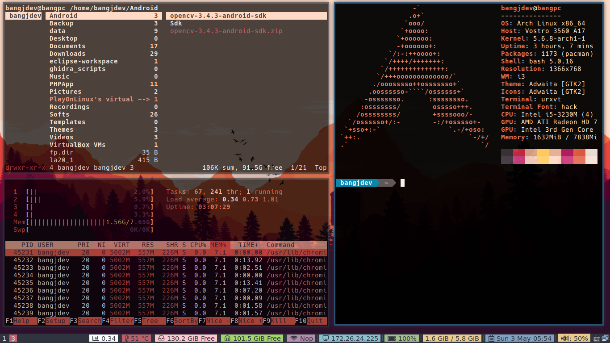

# dotfiles
My personal dotfiles for archlinux - i3wm
Configured to work with 2 monitors, you may need to change some configuration to make it work

# Preview

# Need to install
1) i3wm
2) picom (for transparency)
3) dunst (for notification)
4) powerline, powerline-vim
4) Vim's plugins:
	-	YouCompleteMe
	-	NERDtree
